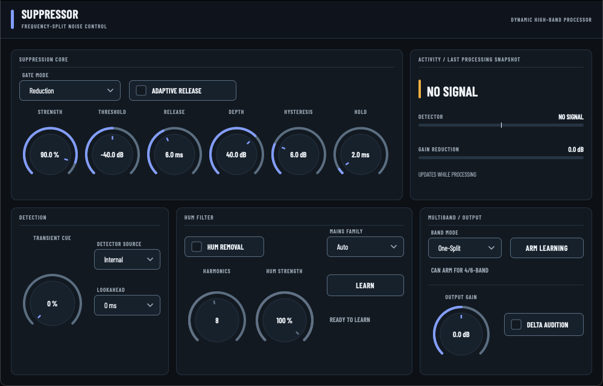

# suppressor

**Zero-latency, frequency-split noise suppressor for guitar DI** — built for
high-gain amp-sim and reamping chains. It sits on the raw DI *before* the amp
sim, strips pickup-borne hiss/buzz/EMI between notes, and leaves the guitar
body alone. Formats: **VST3** and **CLAP** (Windows, macOS, Linux).

[](https://github.com/user1303836/suppressor/actions/workflows/ci.yml)

<p align="center">
  
</p>

## What it does

The core is a causal, sample-domain **dynamic low-pass**:

- the input is split by a fourth-order Linkwitz–Riley-style crossover;
- the **low branch always passes** (body, fundamentals, sustain);
- the **high branch** is gated by an envelope detector that listens to the
  high branch itself — bass energy can't reopen the noise branch, pick
  attack and string harmonics can;
- the gate opens in **10 µs**, holds through waveform zero-crossings, and
  closes on a smooth exponential release.

The result: noise between notes disappears in the band where hiss/buzz
lives, while low mids and body pass untouched and pick transients survive
intact. Zero reported latency in the default mode; negligible CPU (four
biquads plus an envelope per channel).

## Controls

| Section | Controls |
|---|---|
| **Core** | Strength (crossover 8 kHz → 1.4 kHz), Threshold, Release (2–30 ms, exponential) |
| **Gate** | Reduction / Tight Gate mode, Depth floor, Hysteresis, Hold, Adaptive Release |
| **Detection** | Transient Cue, internal/external detector source, 0/1/2 ms lookahead |
| **Hum Removal** | Learn-and-lock resonant dips on the 50/60 Hz family, strength, harmonic count |
| **Multiband** | Optional 4/6-band learned-threshold mode (advanced; one-split is the default) |
| **Output** | Delta (removed-signal) audition, output gain, detector/GR metering |

## Building

Requirements: CMake ≥ 3.22, a C++17 compiler, Ninja (recommended).
JUCE and the CLAP wrapper are fetched automatically (pinned versions).

```bash
cmake -S . -B build -G Ninja -DCMAKE_BUILD_TYPE=Release
cmake --build build --target Suppressor_VST3 Suppressor_CLAP Suppressor_Standalone
```

Outputs land in `build/Source/Suppressor_artefacts/Release/{VST3,CLAP,Standalone}`.

### Unit tests

```bash
cmake -S . -B build-tests -G Ninja -DSUPPRESSOR_BUILD_PLUGIN=OFF -DSUPPRESSOR_BUILD_TESTS=ON
cmake --build build-tests && ctest --test-dir build-tests --output-on-failure
```

### CI

`.github/workflows/ci.yml` gates every push/PR on:

1. **DSP unit tests** on Windows, macOS, and Linux;
2. **VST3 + CLAP builds** on all three platforms (macOS universal);
3. **validation** with pluginval (VST3) and clap-validator (CLAP);
4. per-OS artifact packaging. Tags matching `v*` publish a GitHub release.

## Design documentation

See [`docs/DESIGN.md`](docs/DESIGN.md) for the full DSP specification:
topology, parameter laws, timing, and the rationale behind every
improvement over a plain one-split gate.

## License

GPL-3.0-or-later (see [`LICENSE`](LICENSE)). This project is built with
JUCE (also available under the GPL); a commercial JUCE licence would permit
proprietary relicensing. CLAP is MIT-licensed.
